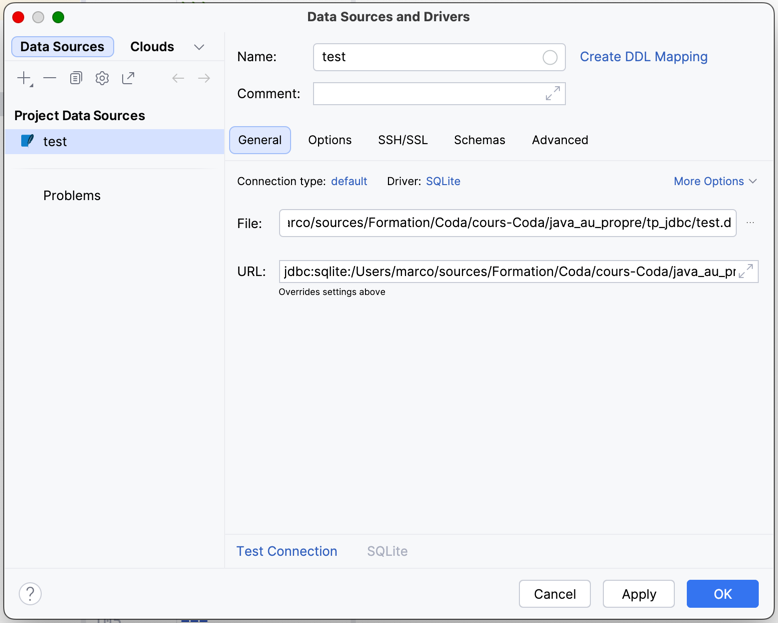
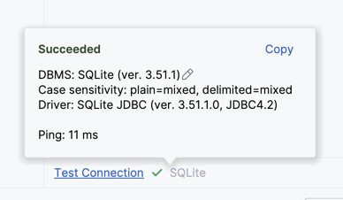
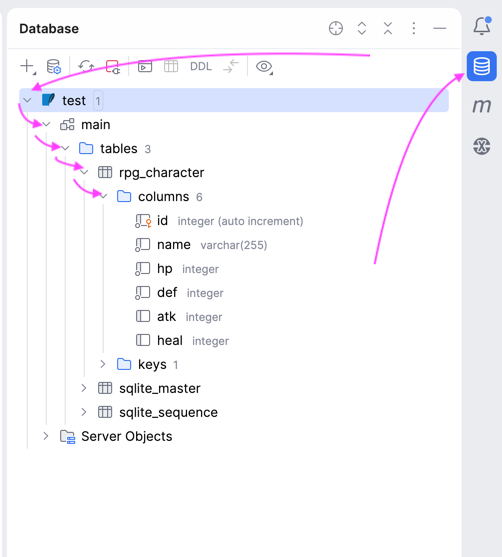
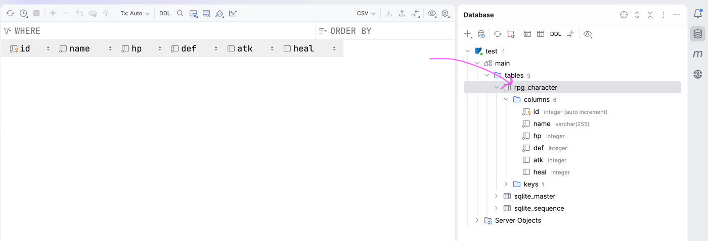
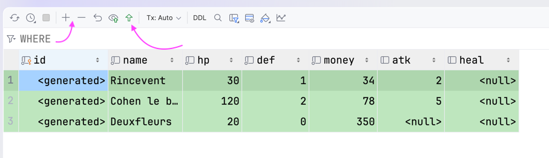
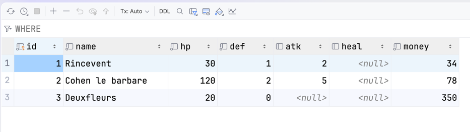
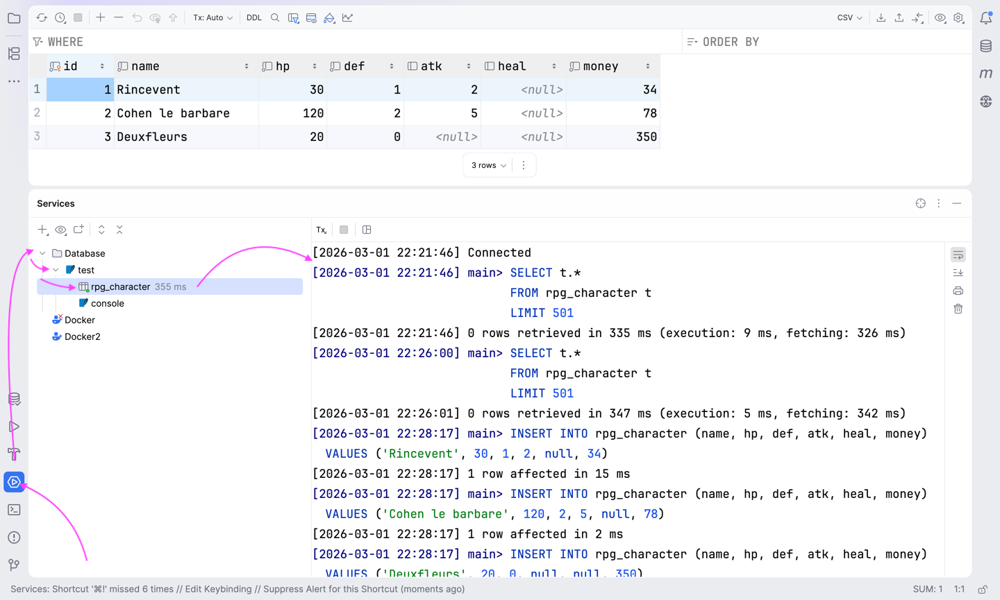
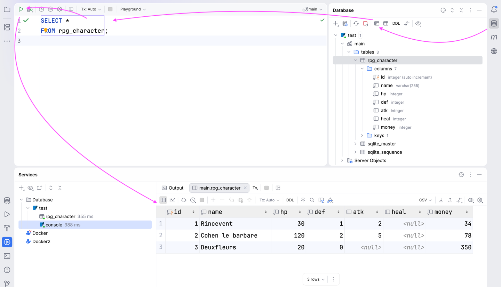

# TP - JDBC pour manipuler une base de données

Programmation Orientée Objet avec Java – Coda 1 ère année – 2026

## Exercice 1 - rpg_character

### 1.1 - Créez un nouveau projet maven

Il doit compiler en java version 25.

- groupId : celui que vous avez utilisé dans le TP du Maven
- artifactId : `tp-jdbc`

### 1.2 - Ajoutez la dépendance du driver JDBC de SQLite

- groupId : `org.xerial`
- artifactId : `sqlite-jdbc`
- version : `3.51.0.0`

### 1.3 - Créer un package

Créez un package correspondant au `groupId` de
votre projet maven suivi de `.tp.jdbc.test`.

Ex: si votre groupId était `foo.bar.baz`,
le nom de votre package serait `foo.bar.baz.tp.jdbc.test`.

### 1.4 - Créer un programme principal

Dans le package que vous venez de créer.

Ajouter une nouvelle classe java nommée `TestJdbc`.

Dans ce fichier ajouter le nécessaire pour que votre programme soit exécutable.

Faites en sorte que ce programme principal affiche le texte suivant dans la console :

```text
Je vais utiliser une base de données.
```

### 1.5 - Se connecter à une base de données

Dans le programme principal, créer **une connexion** à la base de données en lui donnant l'URL suivante :

```text
jdbc:sqlite:test.db
```

**Vous devez gérer les exceptions potentielles**

> 💡une connexion à une base de données est une resource `AutoCloseable`

En cas d'exception du type `SQLException`, affichez un message d'erreur similaire au suivant :

`"Erreur lors de la connexion à la base de données :"` suivi du message correspondant à l'exception.


**Exécutez le programme**

Un fichier `test.db` devrait être apparu à la racine de votre projet.


### 1.6 - Création du modèle de données

Dans votre programme, créez un `Statement`.

> 💡un Statement est une resource `AutoCloseable`

Exécutez la requête suivante à l'aide du statement.

```sql
CREATE TABLE IF NOT EXISTS rpg_character
(
    id   integer      not null 
            constraint rpg_character_pk
            primary key autoincrement,
    name   varchar(255) not null,
    hp     integer      not null,
    def    integer      not null,
    money  integer      not null,
    atk    integer,
    heal   integer,
    job    varchar(20)
)
```

En cas d'erreur `SQLException`, le message suivant doit être affiché :

`"Erreur lors de création de la table rpg_character : "` suivi du message correspondant à l'exception.


### 1.7 - Ouvrir la base de données dans IntelliJ

IntelliJ dispose d'outils intégrés pour afficher et modifier des bases de données.

Double-cliquez sur le fichier `test.db` à la racine de votre projet.

Si nécessaire, télécharger le Driver SQLite.



Vérifier la connexion en cliquant sur "Test Connection"



Valider en cliquant sur "OK"

---

Ouvrir le menu latéral et les outils de base de données

Déplier la base de données `table` jusqu'à voir les colonnes de la table `rpg_character`



### 1.8 - voir les données de la table

Double-cliquer sur la table `rpg_character`.



Une vue en tableau apparait.

### 1.9 - Ajouter des lignes

Dans la vue tableau, ajouter des lignes.

Puis "submit".



La table devrait se mettre à jour;



### 1.10 - Voir le code SQL exécuté par IntelliJ

IntelliJ exécute du code SQL pour nous.

Nous pouvons le voir dans la partie "Services"
en dépliant "Database", puis `test`, puis `rpg_character`.



Nous pourrons nous servir de ces requêtes par la suite dans notre programme.

### 1.11 - Utiliser la Query console

- Retourner dans le menu de base de données
- Jump to query console
- Choisir la query console par défaut

Une zone de texte apparait sur la gauche.

Dans cette zone de texte, saisir la requête suivante :

```sql
SELECT *
FROM rpg_character;
```

Puis exécuter la requête.

Le résultat s'affiche dans le menu "Services" en bas de l'écran.



Ajouter une méthode static dans l'énum pour créer une valeur d'enum à partir de son attribut.

```java

CharacterJob job = CharacterJob.fromName("Warrior");
// devrait retourner WARRIOR
CharacterJob job = CharacterJob.fromName(null);
// devrait retourner RPG_CHARACTER
```
### 1.13 - Écrire un record


Dans un nouveau fichier, créer un **record** nommé `RpgCharacterData`.

Celui-ci doit contenir les attributs suivants :

- `Integer id`
- `String name`
- `int hp`
- `int def`
- `int money`
- `CharacterJob job`
- `Integer atk`
- `Integer heal`

### 1.14 Écrire une requête SQL dans le code Java


À partir du statement existant.

Exécuter la requête suivante afin qu'elle retourne un `ResultSet`.

```sql
SELECT id, name, hp, def, money, job, atk, heal 
FROM rpg_character
```

Tant que le `ResultSet` a des lignes :

Récupérer les valeurs des colonnes :
- `id`
- `name`
- `hp`
- `def`
- `money`
- `job`
- `atk`
- `heal`

Instancier un `RpgCharacter` à partir de ces valeurs.

Afficher le contenu du `RpgCharacter` dans la console.

Ex. Le résultat devrait ressembler à ceci :

```text
[
RpgCharacterData[id=1, name=Rincevent, hp=20, def=0, money=50, atk=1, heal=0, job=MAGE], 
RpgCharacterData[id=2, name=Ridculle, hp=30, def=1, money=150, atk=3, heal=0, job=MAGE], 
RpgCharacterData[id=3, name=Cohen, hp=80, def=3, money=120, atk=7, heal=0, job=WARRIOR], 
RpgCharacterData[id=4, name=Lothar, hp=120, def=3, money=200, atk=4, heal=10, job=PALADIN]
]
```

## Exercice 2 - CRUD

Dans la suite de cet exercice, nous allons
- créer des opérations courantes
  - ajouter
  - modifier
  - supprimer
  - lire

### 2.1 - Renommer `RpgCharacter`

Renommer le record `RpgCharacter` en `RpgCharacterData`.

### 2.2 - Créer une interface `RpgCharacters`

```java

/**
 * Permet de lire, écrire, modifier, supprimer depuis une source de données générique.
 * <p>
 * Peut être implémenté par une base de données, en mémoire, depuis des fichiers...
 * <p>
 * Aucun détails d'implémetation ne devrait être visible dans cette interface
 */
public interface RpgCharacters {

    /**
     * Récupère tous les personnages
     */
    List<RpgCharacterData> all();

    /**
     * Récupère tous les personnages pour un métier donné
     * @param job métier
     * @return tous les personnages
     */
    List<RpgCharacterData> allByJob(CharacterJob job);

    /**
     * Récupère un personnage par son identifiant
     * @param id
     * @return le personnage ou vide
     */
    Optional<RpgCharacterData> find(int id);

    /**
     * Supprime un personnage par son identifiant
     * @param id
     */
    void delete(int id);

    /**
     * Supprime un personnage par son identifiant
     * @param characterData
     */
    void update(RpgCharacterData characterData);

    /**
     * Créer un personnage
     * <p>
     * <b>Note:</b> l'id du paramètre sera ignoré car il est généré par la couche de persistance.
     * @param characterData
     * @return identifiant du personnage créé
     */
    int create(RpgCharacterData characterData);


}

```


### Implémenter l'interface


Créer une classe `SqliteRpgCharacters` qui implémente l'interface `RpgCharacters`.

Elle s'appuiera sur la base de données pour son implémentation.


### Bonus

Écrire un programme **en ligne de commande** qui permette de :

- lister le `nom` et `id` tous les personnages disponibles
- d'afficher les détails d'un personnage par son `id`
- de supprimer un personnage par son `id`
- de modifier le `nom` d'un personnage
- d'ajouter un personnage


## Exercice 3 - RPG + database

- ajouter une dépendance au projet rpg existant
- instancier nos personnage depuis leur données provenant de la base de données.

### 3.1 - Configurer le dépot nexus

Dans le `pom.xml`

Ajouter les lignes suivantes pour configurer le dépôt nexus du cours de java.

```xml
    <distributionManagement>
        <repository>
            <id>coda_lab</id>
            <url>https://nexus.baldir.fr/repository/coda_lab/</url>
            <name>coda_lab</name>
        </repository>
    </distributionManagement>
    <repositories>
        <repository>
            <id>coda_lab</id>
            <url>https://nexus.baldir.fr/repository/coda_lab/</url>
            <name>coda_lab</name>
        </repository>
    </repositories>
```


### 3.2 - Inclure la lib rpg depuis le nexus.


Ajouter la dépendance `rpg-lib` il s'agit du corrigé du TP RPG déployé sur un repository maven en tant que bibliothèque.

```xml
  <dependency>
      <groupId>school.coda.rpg</groupId>
      <artifactId>rpg-lib</artifactId>
      <version>1.2</version>
  </dependency>
```

Pour référence, le code source est disponible sur https://github.com/coda-school/java-mvn-multi-module

### 3.3 `asRpgCharacter`

Écrire du code de "mapping" qui permet d'instancier les bons types de personnages à partir de `RpgCharacterData`.

L'instance retournée doit correspondre au `job` du personnage. 

Ce code sera écrit **DANS** `RpgCharacterData`.

#### Point de départ

```java
   
    public RpgCharacter asRpgCharacter() {
        // TODO: à implémenter
        throw new UnsupportedOperationException("RpgCharacterData::asRpgCharacter() n'est pas encore implémenté");
    }

```

#### Exemples d'utilisation

Ex. devrait instancier un objet de type `RpgCharacter`
 ```java
 var data = new RpgCharacterData("Villageois", 10, 0, 12, CharacterJob.RPG_CHARACTER, null, null);
RpgCharacter villageois = data.asRpgCharacter();

var data2 = new RpgCharacterData("Sans métier", 10, 0, 12, null, null, null);
RpgCharacter noJob = data2.asRpgCharacter();
 ```

Ex. devrait instancier un objet de type `Mage`
 ```java
 var data = new RpgCharacterData("Rincevent", 40, 2, 25, CharacterJob.MAGE, 2, null);
RpgCharacter rincevent = data.asRpgCharacter();
 ```

Ex. devrait instancier un objet de type `Warrior`
 ```java
 var data = new RpgCharacterData("Cohen", 120, 5, 50, CharacterJob.WARRIOR, 10, null);
RpgCharacter cohen = data.asRpgCharacter();
 ```

Ex. devrait instancier un objet de type `Paladin`
 ```java
 var data = new RpgCharacterData("Lothar", 40, 3, 75, CharacterJob.PALADIN, 5, 10);
RpgCharacter lothar = data.asRpgCharacter();
 ```

Ex. devrait instancier un objet de type `Priest`
 ```java
 var data = new RpgCharacterData("Elune", 50, 7, 0, CharacterJob.PRIEST, 60, 100);
RpgCharacter elune = data.asRpgCharacter();
 ```


### 3.4 `asHealer()`

Écrire du code de "mapping" qui permet d'instancier un `Optional<Healer>` à partir de `RpgCharacterData`.

L'instance retournée doit correspondre au `job` du personnage.

Si le personnage n'est pas un `Healer`, retourne un `Optional` vide.

Ce code sera écrit **DANS** `RpgCharacterData`.

#### Point de départ

```java

    public Optional<Healer> asHealer() {
        // TODO: à implémenter
        throw new UnsupportedOperationException("RpgCharacterData::asHealer() n'est pas encore implémenté");
    }

    
```

Ex. devrait instancier un objet de type `Optional<Paladin>`
```java
var data = new RpgCharacterData("Lothar", 40, 3, 75, CharacterJob.PALADIN, 5, 10);
Optional<Healer> optionalHealer = data.asHealer();
// Optional.isPresent() --> true
// Paladin
```

Ex. devrait instancier un objet de type `Optional<Priest>`
```java
 var data = new RpgCharacterData("Elune", 50, 7, 0, CharacterJob.PRIEST, 60, 100);
Optional<Healer> optionalHealer = data.asHealer();
// Optional.isPresent() --> true
// Priest
```


Ex. devrait instancier un `Optional` vide
```java
 var data = new RpgCharacterData("Cohen", 120, 5, 50, CharacterJob.WARRIOR, 10, null);
Optional<Healer> optionalHealer = data.asHealer();
// Optional.isPresent() --> false
```


### 3.5 `asAttacker()`


Écrire du code de "mapping" qui permet d'instancier un `Optional<Attacker>` à partir de `RpgCharacterData`.

L'instance retournée doit correspondre au `job` du personnage.

Si le personnage n'est pas un `Attacker`, retourne un `Optional` vide.

Ce code sera écrit **DANS** `RpgCharacterData`.

```java
public Optional<Attacker> asAttacker() {
        // TODO: à implémenter
        throw new UnsupportedOperationException("RpgCharacterData::asAttacker() n'est pas encore implémenté");
    }
```

Exemples d'usage


Ex. devrait instancier un objet de type `Optional<Warrior>`
```java
var data = new RpgCharacterData("Cohen", 120, 5, 50, CharacterJob.WARRIOR, 10, null);
Optional<Attacker> optionalAttacker = data.asAttacker();
// Optional.isPresent() --> true
// Warrior
```

Ex. devrait instancier un `Optional` vide
```java
 var data = new RpgCharacterData("Elune", 50, 7, 0, CharacterJob.PRIEST, 60, 100);
Optional<Attacker> optionalAttacker = data.asAttacker();
// Optional.isPresent() --> false
```
